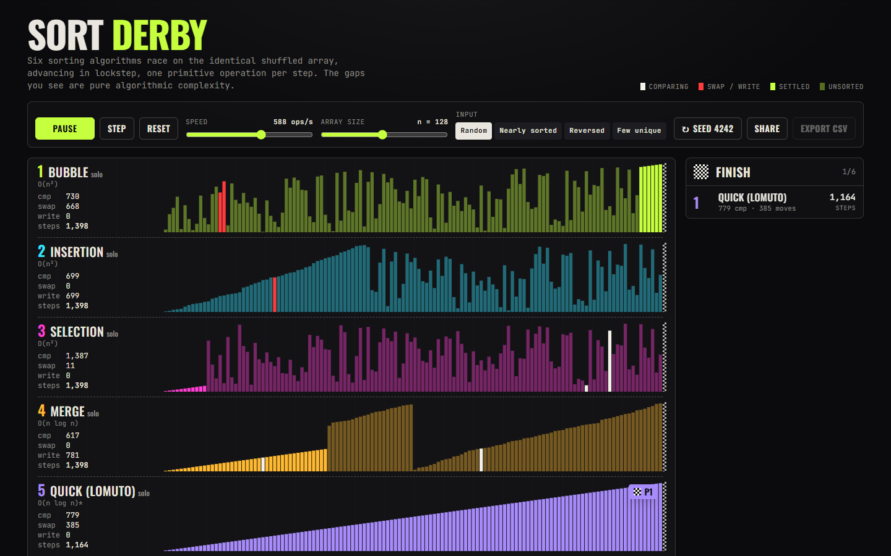

# Sort Derby

Six sorting algorithms race side by side on the same shuffled data, with live
comparison/swap counters and a photo-finish leaderboard.



Hit **Start** and six lanes of bars begin churning in lockstep, one primitive
operation per step. Quicksort crosses the finish line while bubble sort is still
on its third pass, and the leaderboard stamps exact comparison counts as each
lane finishes. The gaps between lanes are not animation timing; they are
algorithmic complexity made visible.

## Features

- **Six hand-written algorithms as step generators** - bubble, insertion,
  selection, merge, quick (Lomuto partition) and heap. No sorting library; each
  is a `function*` that yields typed events over a private copy of the array.
- **Shared seeded input** - a mulberry32 PRNG builds one array that every lane
  sorts. Presets: random, nearly-sorted, reversed, few-unique. The seed is shown
  in the toolbar and can be reshuffled.
- **Lockstep race controls** - global play / pause / step, a log-scale speed
  slider (4 to 16k ops/s) and an array-size slider (8 to 256). Every unfinished
  lane receives exactly the same number of work units per frame.
- **Live per-lane counters** - comparisons, swaps, writes and total steps, all
  derived from the event stream, plus a finish-order leaderboard that slides in
  under a checkered flag.
- **Bar colouring** - compared indices flash white, swapped/written indices
  flash red, settled indices go fully saturated in the lane's neon.
- **Solo mode** - click a lane name (or press `1`-`6`) to expand it to full
  width beside a pseudocode panel that highlights the line being executed.
- **CSV export** of the final stats, and **shareable links**
  (`?preset=reversed&n=128&seed=7&autostart`) that reproduce a race exactly.
- Keyboard: `Space` play/pause, `→` step, `R` reset, `1`-`6` solo, `Esc` back.

## How it works

Every algorithm is a generator with the signature
`(input: readonly number[]) => Generator<Step, number[]>`. It copies the input,
sorts the copy the classic way, and at each primitive operation `yield`s one
event instead of counting anything itself:

```ts
type Step =
  | { type: 'compare'; indices: [number, number]; line: number }
  | { type: 'swap';    indices: [number, number]; line: number }
  | { type: 'write';   indices: [number]; value: number; line: number }
  | { type: 'settle';  indices: number[]; line: number }
```

`compare`, `swap` and `write` are *work* and cost one step each; `settle` is
free bookkeeping that marks indices as final. `line` points at the pseudocode
line that produced the event, which is all solo mode needs to highlight the
right row. Bubble sort on `[5, 3, 1, 4, 2]` emits 23 events, 17 of them work:

```
pass 1  compare[0,1] swap[0,1] compare[1,2] swap[1,2] compare[2,3] swap[2,3]
        compare[3,4] swap[3,4]                                  settle[4]
pass 2  compare[0,1] swap[0,1] compare[1,2] compare[2,3] swap[2,3]  settle[3]
pass 3  compare[0,1] compare[1,2] swap[1,2]                         settle[2]
pass 4  compare[0,1]                                                settle[1]
                                                                    settle[0]
=> comparisons: 10, swaps: 7, writes: 0, steps: 17
```

The race engine holds one lane per algorithm. Each lane keeps a *mirror* array
that is rebuilt purely by replaying `swap` and `write` events - the UI never
reads the algorithm's private copy. That is deliberate: if a sort forgot to
emit an event, its bars would visibly desynchronise from its result, and a test
asserts the mirror equals the returned array for every algorithm. Stats are
folded from the same stream by a tiny reducer (`tallyStep`), so the numbers on
the leaderboard are provably the operations the pixels showed.

Lockstep is a round-robin: `race.tick(k)` pulls exactly `k` work events from
every unfinished generator, so a lane's position depends only on how many
operations its algorithm needs. The animation loop converts the speed slider
into `ops/s * dt`, carrying the fractional remainder between frames so very
slow speeds still creep forward. On a random array of 128, quicksort finishes
in about 1,160 steps and bubble sort needs about 11,500 - and on the *reversed*
preset, Lomuto quicksort collapses to 8,192 steps, the same as selection sort,
which is the footnote on the page inviting you to try it.

## Run

```sh
npm install
npm run dev        # local dev server
npm run build      # type-check (tsc -b) + production bundle in dist/
npm test           # vitest: 29 assertions across the sorts, engine, share links and CSV
```

Tests include the exact-count cases the project was specified against:
bubble on `[5,3,1,4,2]` makes 10 comparisons, merge on a reversed 8-array makes
12, insertion on already-sorted input makes n-1 comparisons and 0 swaps, and all
six algorithms sort the same `seededArray(200, 42)` to the same result.

## Tech

- React 19 + TypeScript (strict, `erasableSyntaxOnly`), Vite 8
- Tailwind CSS 4 via `@tailwindcss/vite` with a small `@theme` for the asphalt /
  neon palette
- Canvas 2D for the bars (one canvas per lane, DPR-aware, `ResizeObserver`)
- Fonts: Oswald Variable for the tall condensed lane labels, JetBrains Mono for
  everything else - both bundled from `@fontsource`
- Vitest for tests; no runtime dependencies beyond React

## License

MIT - see [LICENSE](LICENSE).
